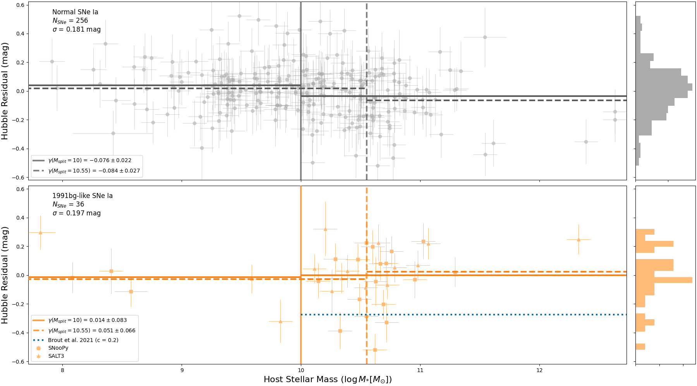
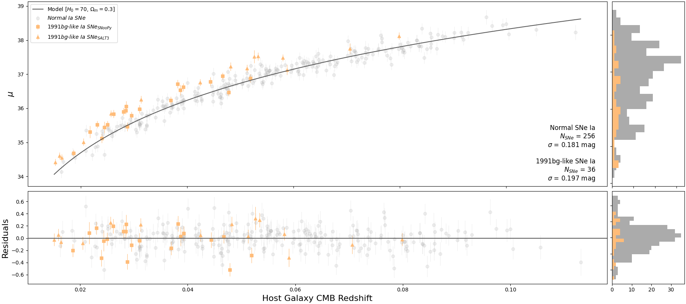
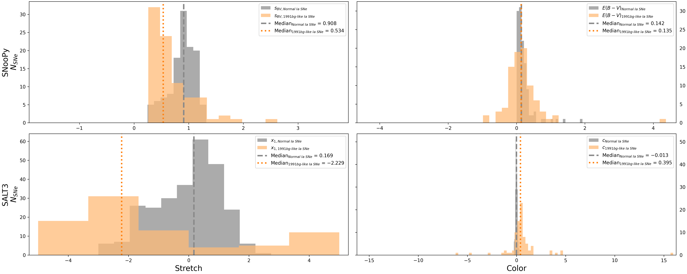
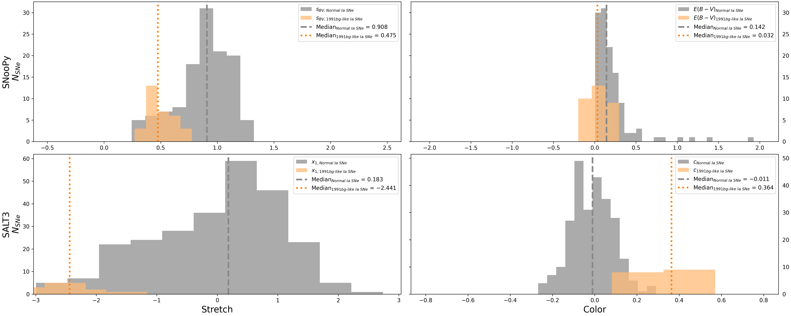
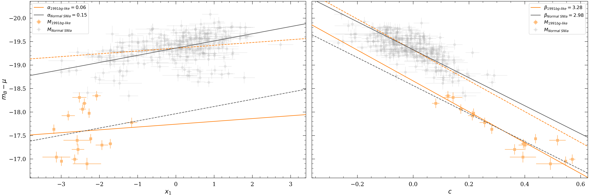
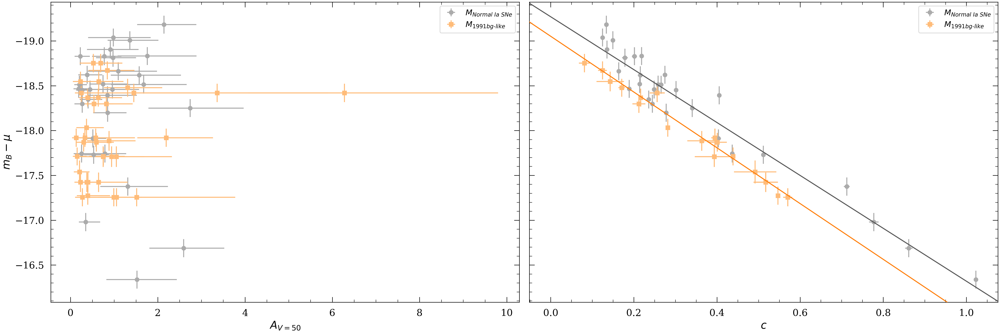
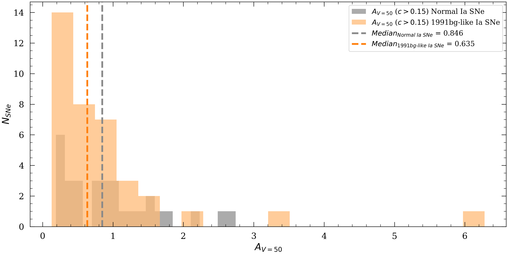

# MSF-91bg – Mass-Step Function of 1991bg-like SNe Ia 
At the end of the star's life, it can go out in two likely ways: quietly into the night with one last burst of light or by dragging its companions down with it. The former, core-collapse supernovae, have their own rich history, but the latter, thermonuclear supernovae, bring with them an abundance of inspiring questions. 

1991bg-like supernovae (SNe) are a SNe Type Ia that behave similarly to the supernova SN1991bg. This subtype of SNe Type Ia is **fast-declining**, declines faster than Normal SNe Ia after 15 days of peak B-band brightness, and **subluminous**, 1.5–2.5 magnitudes less at peak B-band brightness. 

In this study, we investigate this subtype using the paramters of distance and host stellar mass. In normal populations of SNe Type Ia, the weighted average of the SN's host galaxy's stellar mass **decreases** after $log(10)M/M_{\odot}$. To determine this we combine data from three all-sky surveys: [The Carnegie Supernova Project (CSP)](https://csp.obs.carnegiescience.edu/), [The Asteroid 
Asteroid Terrestrial-impact Last Alert System (ATLAS)](https://atlas.fallingstar.com/), and [The Zwicky Transient Facility (ZTF)](https://www.ztf.caltech.edu/). These servers gives excellent photometry data that we can then use light curve fitting algorithms, in our case [SNooPy](https://csp.obs.carnegiescience.edu/data/snpy) and [SALT3](https://saltshaker.readthedocs.io/en/latest/), to determine the distances, $\mu$, of each supernova and their host. Finally, we can produce stellar host masses using [GHOST](https://uiucsnastro-ghost.readthedocs.io/en/latest/), a tool that searches accross several extragalactic databases to determine stellar host galaxy masses.

From this research, we determined that there is strong evidence that 1991bg-like SNe Ia follow the inverse of this relationship. The weighted stellar host mass average **increases** after both $log(10)M/M_{\odot}$ and the median stellar host mass. 

Future investigations into this phenonomn include investigation the dependency of interstellar dust and if this same mass-step phenomena occurs with other SNe Type Ia subtypes (1991T-like, 2003fg-like, 2003es-like). 

_This repository is **open-source** via an **MIT License** and encourged to be replicated with goal of further our collective understanding of our universe._

_For a more resources on the nature of this research and to read the full report, follow the links bellow._\
[MSF-91bg – Project Page](https://tinyurl.com/astrokhi](https://sites.google.com/hawaii.edu/astrokhi/research/msf-91bg?authuser=2))\
arXiv Full Research Paper -- _Comming soon!_

__NOTE: This repository is currently under construction__
--------------------------
## Developers
* Developer: [Mekhi Woods](https://tinyurl.com/astrokhi) (mekhidw@hawaii.edu)
* Advisor: [David Jones](https://github.com/djones1040) (dojones@hawaii.edu)

--------------------------
## Getting Started
1. Install necessary packages by running `pip install -r requirements.txt`
2. Place `api_keys.txt` in working directory with proper TNS & ATLAS API keys (tns_bot_id, tns_bot_name, tns_bot_api_key, atlas_key).
   * Format per line: "[key_name], [key]"
3. Place `twomass++_velocity_LH11.npy` in working directory. ([Download](https://drive.google.com/file/d/1DGcWQPgmI2ZoHJm_zCqyscogmWwY7lQu/view?usp=sharing))

--------------------------
## Operation Guide
1. Navigate to the main python file `main.py` in working directory.

If any instructions are unclear, please run `help()` to see examples of each fit type.

--------------------------
## Statistics
### Data Statistics **Before** Fitting Selection Criteria
| Survey | $N_{SNe}$ | Redshift Range | Declination Range | Average Magnitude $\pm5$ days from peak $m_{B}$ | Average Magnitude Error $\pm5$ days from peak $m_{B}$ |
| :----------------- | ----: | ------------------: | ---------------------: | --------: | -------: |
| CSP                | $11$  | $0.0039$ - $0.0424$ | $-24.9441$ - $20.5262$ | $17.1799$ | $0.0259$ |
| ATLAS              | $10$  | $0.0149$ - $0.0594$ | $-44.2625$ - $74.8300$ | $17.3974$ | $0.0870$ |
| ZTF                | $20$  | $0.0160$ - $0.1002$ | $-22.4477$ - $65.4675$ | $18.8785$ | $0.1230$ |
| ATLAS-ZTF$^{\ast}$ | $61$  | $0.0055$ - $0.0706$ | $-27.2149$ - $86.9325$ | $18.2714$ | $0.1098$ |
| All Surveys        | $102$ | $0.0039$ - $0.1002$ | $-44.2625$ - $86.9325$ | $18.2427$ | $0.1049$ |

$\ast$ ATLAS and ZTF have 61 SNe that overlap, so these data points contains the $c$, $o$, $g$, $r$, and $i$-bands.

### Selection Criteria 
| Parameter                  | SNooPy                             | SALT |     
| :------------------------- | ---------------------------------: | ---------------------: |
| Redshift                   | $z > 0.015$                        | $z > 0.015$            |
| Color                      | $-0.2 < E(B-V)_{\rm host} < 0.3$   | $-0.6 < c < 0.6$       | 
| Color Error                | $\sigma_{E(B-V)_{\rm host}} < 0.1$ | $\sigma_{c} < 0.1 $    | 
| Stretch                    | $s_{BV} < 1.0$                     | $x_1 < 0.0$            | 
| Stretch Error              | $\sigma_{s_{BV}} < 0.1$            | $\sigma_{x_{1}} < 0.1$ |
| $\mu$ Error                | $\sigma_{\mu} < 0.2$               | $\sigma_{\mu} < 0.2$   |
| Peak Brightness Time Error | $\sigma_{t_0} < 1.0$               | $\sigma_{t0} < 1.0$    |

### Data Statistics **After** Fitting Selection Criteria
| Survey      | $N_{SNe}$ | Redshift Range | Declination Range | Average Magnitude $\pm5$ days from peak $m_{B}$ | Average Magnitude Error $\pm5$ days from peak $m_{B}$ |
| :---------- | ---:      | ------------------: | ---------------------: | --------: | -------: |
| CSP         | $5$       | $0.0152$ - $0.0424$ | $-13.1031$ - $20.5262$ | $17.6135$ | $0.0288$ |
| ATLAS       | $2$       | $0.0240$ - $0.0244$ | $8.5583$   - $74.8300$ | $17.5216$ | $0.0582$ |
| ZTF         | $9$       | $0.0160$ - $0.0798$ | $-22.4477$ - $52.1151$ | $18.5232$ | $0.0535$ |
| ATLAS-ZTF   | $20$      | $0.0186$ - $0.0706$ | $-25.9271$ - $61.5949$ | $18.5143$ | $0.1004$ |
| All Surveys | $36$      | $0.0152$ - $0.0798$ | $-25.9271$ - $74.8300$ | $18.4019$ | $0.0807$ |

--------------------------
## Recent Plots
### Hubble Residual v. Host Mass
This plot depicts the relationship between the mass of the host galaxy for the SN and the corresponding Hubble Residual.

### Hubble Diagram (Distance v. Redshift)
This plot depicts the relationship between the redshift of the SN and the corresponding Hubble Residual.

-------------------------- 
### SNooPy & SALT3 Parameter Histograms 
#### Before Selection Criteria 

#### After Selection Criteria 

--------------------------
### SALT3 Distance Modulus Constants (Alpha-Beta) Fitting
 

--------------------------
### Dust Dependency of Red SNe
 
 

--------------------------
## Publications
Please cite the following if this repo is utilized for a scientific project:
* Kenworthy et al. 2021. [SALT3: An Improved Type Ia Supernova Model for Measuring Cosmic Distances](https://ui.adsabs.harvard.edu/abs/2021ApJ...923..265K/abstract)
* Krisciunas et al. 2017. [The Carnegie Supernova Project. I. Third Photometry Data Release of Low-redshift Type Ia 
Supernovae and Other White Dwarf Explosions](https://ui.adsabs.harvard.edu/abs/2017AJ....154..211K/abstract)
* Burns et al. 2014. [The Carnegie Supernova Project: Intrinsic Colors of Type Ia Supernovae](https://ui.adsabs.harvard.edu/abs/2014ApJ...789...32B/abstract)
* Burns et al. 2011. [The Carnegie Supernova Project: Light-curve Fitting with SNooPy](https://ui.adsabs.harvard.edu/abs/2011AJ....141...19B/abstract)

--------------------------
## Dependencies
* python ( >= 3.11.9 )
* snpy==2.7.0 (MacOS/Linux)
* astro_ghost==2.1.5 
* astropy==6.0.1 
* astroquery==0.4.7 
* matplotlib==3.9.2 
* numpy==2.1.1 
* Requests==2.32.3 
* sncosmo==2.11.1
* iminuit==2.29.1
* corner~=2.2.2
