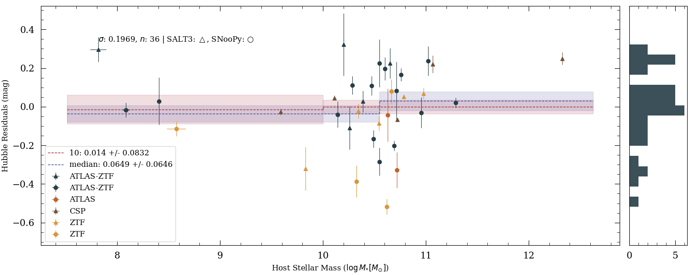
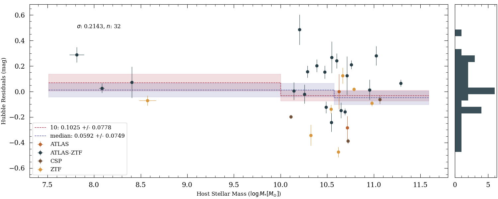
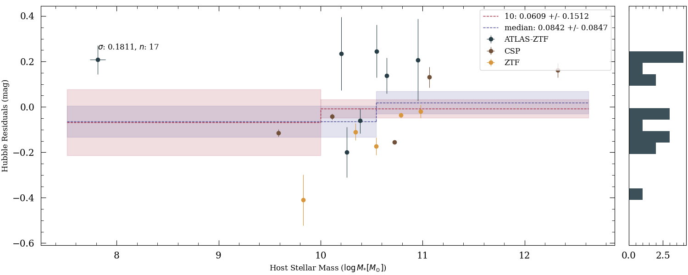
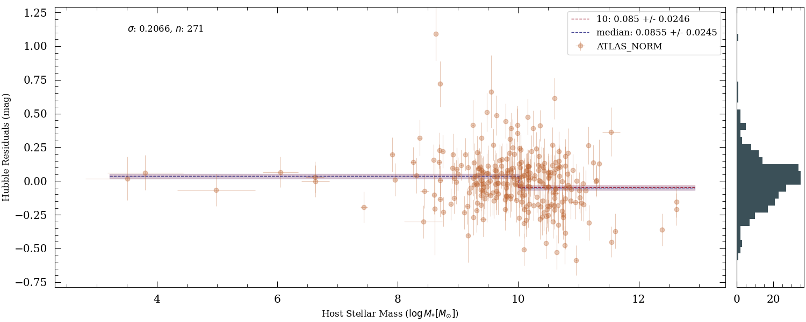
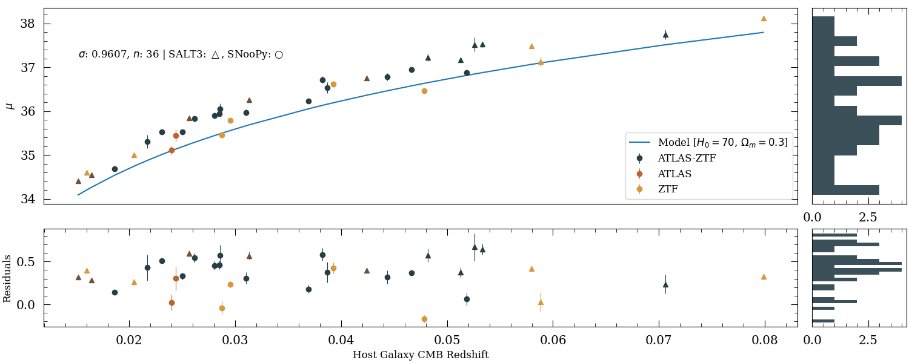

# Mass Step of Type-1a Supernova 1991bg
This repository works to analyze and calculate the mass step function of Supernovae Type Ia using forced photometry 
data from the ATLAS and ZTF sky surveys. This project is a segment of the collaboration 
'Hilo Cosmology And Transients (CATs)', an initiative operative from the University of Hawaii.  

__NOTE: This repository is currently under construction__
--------------------------
## Developers
* Developer: [Mekhi Woods](https://tinyurl.com/astrokhi) (mekhidw@hawaii.edu)
* Advisor: [David Jones](https://github.com/djones1040) (dojones@hawaii.edu)

--------------------------
## Operation Guide
1. Install necessary dependencies:
   * Install necessary packages by running `pip install -r requirements.txt`
   * Place `api_keys.txt` in working directory with proper TNS API keys (tns_bot_id/tns_bot_name/tns_bot_api_key). 
   * Place `twomass++_velocity_LH11.npy` in working directory. 
2. Navigate to the main python file `verthandi.py`
3. Within the `if __name__ == '__main__'` statement, call `smart_fit()`
4. `smart_fit()` is able to fit individual SNe, batch fit for CSP/ATLAS/ZTF data, or fit all data at once.
   * _Individual:_ `fit_type='indv'`, include `data_set` ('CSP'/'ATLAS'/'ZTF'), include `path` (path to data file)    
   * _Batch:_ `fit_type='batch'`, include `data_set` ('CSP'/'ATLAS'/'ZTF')
   * _Combined:_ `fit_type='combined'` 
5. For each call of `smart_fit()`, the fitting algorithm must be specified via the `algo` variable ('snpy'/'salt').
6. Additionally, `save_loc` can be called to specify the save location. 

If any instructions are unclear, please run `help()` to see examples of each fit type.

[//]: # ([TwoMass download here]&#40;https://www.dropbox.com/scl/fi/7hzwmr4xn3pd8pwaqh67i/twomass-_velocity_LH11.npy?rlkey=r2cvszip56wc6js8ebioaynj5&dl=0&#41;. )

--------------------------
### Hubble Residual v. Host Mass
This plot depicts the relationship between the mass of the host galaxy for the SN and the corresponding Hubble Residual. 

For perspective, below is the same plot for normal SNe Ia.

--------------------------
## Recent Plots
### Hubble Residual v. Redshift
This plot depicts the relationship between the redshift of the SN and the corresponding Hubble Residual.

--------------------------
### Parameter Histograms

[//]: # (![]&#40;saved/readme_plots/allparam_cornerPlot.png ""&#41;)

Corner Plot of SNooPy Parameters

Corner Plot of SALT3 Parameters

--------------------------
## Publications
Please cite the following if this repo is utilized for a scientific project:
* Kenworthy et al. 2021. [SALT3: An Improved Type Ia Supernova Model for Measuring Cosmic Distances](https://ui.adsabs.harvard.edu/abs/2021ApJ...923..265K/abstract)
* Krisciunas et al. 2017. [The Carnegie Supernova Project. I. Third Photometry Data Release of Low-redshift Type Ia 
Supernovae and Other White Dwarf Explosions](https://ui.adsabs.harvard.edu/abs/2017AJ....154..211K/abstract)
* Burns et al. 2014. [The Carnegie Supernova Project: Intrinsic Colors of Type Ia Supernovae](https://ui.adsabs.harvard.edu/abs/2014ApJ...789...32B/abstract)
* Burns et al. 2011. [The Carnegie Supernova Project: Light-curve Fitting with SNooPy](https://ui.adsabs.harvard.edu/abs/2011AJ....141...19B/abstract)

--------------------------
## Dependencies
* python ( >= 3.11.9 )
* snpy==2.7.0 (MacOS/Linux)
* astro_ghost==2.1.5 
* astropy==6.0.1 
* astroquery==0.4.7 
* matplotlib==3.9.2 
* numpy==2.1.1 
* Requests==2.32.3 
* sncosmo==2.11.1
* iminuit==2.29.1
* corner~=2.2.2