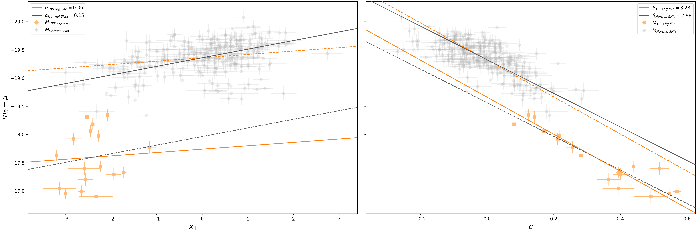

# MSF-91bg – Mass-Step Function of 1991bg-like SNe Ia 
At the end of the star's life, it can go out in two likely ways: quietly into the night with one last burst of light or 
by dragging its companions down with it. The former, core-collapse supernovae, have their own rich history, but the 
latter, thermonuclear supernovae, bring with them an abundance of inspiring questions. 

1991bg-like supernovae (SNe) are a SNe Type Ia that behave similarly to the supernova SN1991bg. This subtype of SNe 
Type Ia is **fast-declining**, declines faster than Normal SNe Ia after 15 days of peak B-band brightness, and 
**sub-luminous**, 1.5–2.5 magnitudes less at peak B-band brightness. 

In this study, we investigate this subtype using the parameters of distance and host stellar mass. In normal 
populations of SNe Type Ia, the weighted average of the SN's host galaxy's stellar mass **decreases** after 
$\log_{10}(M_{\ast}/M_{\odot}) = 10$. To determine this we combine data from three (3) sky surveys: 
[The Carnegie Supernova Project-I: Third Photometric Data Release (CSP) (Krisciunas et al., 2017)](https://ui.adsabs.harvard.edu/abs/2017AJ....154..211K/abstract), 
[The Asteroid Terrestrial-impact Last Alert System (ATLAS)](https://atlas.fallingstar.com/), and 
[The Zwicky Transient Facility (ZTF)](https://www.ztf.caltech.edu/). These servers gives excellent photometry data that we can then use light 
curve fitting algorithms, in our case [SNooPy](https://csp.obs.carnegiescience.edu/data/snpy) and 
[SALT3](https://saltshaker.readthedocs.io/en/latest/), to determine the distances, $\mu$, of each 
supernova and their host. Finally, we can produce stellar host masses using 
[GHOST](https://uiucsnastro-ghost.readthedocs.io/en/latest/), a tool that searches across 
several extragalactic databases to determine stellar host galaxy masses.

From this research, we determined that there is strong evidence that 1991bg-like SNe Ia follow the inverse of this 
relationship. The weighted stellar host mass average **increases** after both $\log_{10}(M_{\ast}/M_{\odot}) = 10$ 
and the median stellar host mass. 

Future investigations into this phenomenon include investigation the dependency of interstellar dust and if this same 
mass-step phenomena occurs with other SNe Type Ia subtypes (1991T-like, 2003fg-like, 2003es-like). 

_This repository is **open-source** via an **MIT License** and encouraged to be replicated with goal of further our 
collective understanding of our universe._

_For a more resources on the nature of this research and to read the full report, follow the links bellow._\
[MSF-91bg – Project Page](https://tinyurl.com/astrokhi](https://sites.google.com/hawaii.edu/astrokhi/research/msf-91bg?authuser=2))\
arXiv Full Research Paper -- _Coming soon!_

__NOTE: This repository is currently under construction__
--------------------------
## Developers
* Developer: [Mekhi Woods](https://tinyurl.com/astrokhi) (mekhidw@hawaii.edu)
* Advisor: [David Jones](https://github.com/djones1040) (dojones@hawaii.edu)

--------------------------
## Getting Started
1. Install necessary packages by running `pip install -r requirements.txt`
2. Place `api_keys.txt` in working directory with proper TNS API keys (tns_bot_id, tns_bot_name, tns_bot_api_key).
   * Format per line: "[key_name], [key]"
3. Place `twomass++_velocity_LH11.npy` in working directory. ([Download](https://drive.google.com/file/d/1DGcWQPgmI2ZoHJm_zCqyscogmWwY7lQu/view?usp=sharing))
4. Ensure that the following directories are in \data\ and have contents.
   * \data\CSP-91bg
   * \data\CSP-norm
   * \data\ATLAS-91bg
   * \data\ATLAS-norm
   * \data\ZTF-91bg
   * \data\ZTF-norm

--------------------------
## Operation Guide
1. Navigate to the main python file `main.py` in working directory.

If any instructions are unclear, please run `help()` to see examples of each fit type.

--------------------------
## Statistics
### Data Statistics **Before** Fitting Selection Criteria
| Survey             | $N_{SNe}$ |      Redshift Range |      Declination Range | Average Magnitude $\pm5$ days from peak $m_{B}$ | Average Magnitude Error $\pm5$ days from peak $m_{B}$ |
|:-------------------|----------:|--------------------:|-----------------------:|------------------------------------------------:|------------------------------------------------------:|
| CSP                |      $11$ | $0.0039$ - $0.0424$ | $-24.9441$ - $20.5262$ |                                       $17.1799$ |                                              $0.0259$ |
| ATLAS              |      $10$ | $0.0149$ - $0.0594$ | $-44.2625$ - $74.8300$ |                                       $17.3974$ |                                              $0.0870$ |
| ZTF                |      $20$ | $0.0160$ - $0.1002$ | $-22.4477$ - $65.4675$ |                                       $18.8785$ |                                              $0.1230$ |
| ATLAS-ZTF$^{\ast}$ |      $61$ | $0.0055$ - $0.0706$ | $-27.2149$ - $86.9325$ |                                       $18.2714$ |                                              $0.1098$ |
| All Surveys        |     $102$ | $0.0039$ - $0.1002$ | $-44.2625$ - $86.9325$ |                                       $18.2427$ |                                              $0.1049$ |

$\ast$ ATLAS and ZTF have 61 SNe that overlap, so these data points contains the $c$, $o$, $g$, $r$, and $i$-bands.

### Selection Criteria 
| Parameter                  |                             SNooPy |                   SALT |     
|:---------------------------|-----------------------------------:|-----------------------:|
| Redshift                   |                        $z > 0.015$ |            $z > 0.015$ |
| Color                      |   $-0.2 < E(B-V)_{\rm host} < 0.3$ |       $-0.6 < c < 0.6$ | 
| Color Error                | $\sigma_{E(B-V)_{\rm host}} < 0.1$ |    $\sigma_{c} < 0.1 $ | 
| Stretch                    |                     $s_{BV} < 1.0$ |            $x_1 < 0.0$ | 
| Stretch Error              |            $\sigma_{s_{BV}} < 0.1$ | $\sigma_{x_{1}} < 0.1$ |
| $\mu$ Error                |               $\sigma_{\mu} < 0.2$ |   $\sigma_{\mu} < 0.2$ |
| Peak Brightness Time Error |               $\sigma_{t_0} < 1.0$ |    $\sigma_{t0} < 1.0$ |

### Data Statistics **After** Fitting Selection Criteria
| Survey      | $N_{SNe}$ |      Redshift Range |      Declination Range | Average Magnitude $\pm5$ days from peak $m_{B}$ | Average Magnitude Error $\pm5$ days from peak $m_{B}$ |
|:------------|----------:|--------------------:|-----------------------:|------------------------------------------------:|------------------------------------------------------:|
| CSP         |       $5$ | $0.0152$ - $0.0424$ | $-13.1031$ - $20.5262$ |                                       $17.6135$ |                                              $0.0288$ |
| ATLAS       |       $2$ | $0.0240$ - $0.0244$ | $8.5583$   - $74.8300$ |                                       $17.5216$ |                                              $0.0582$ |
| ZTF         |       $9$ | $0.0160$ - $0.0798$ | $-22.4477$ - $52.1151$ |                                       $18.5232$ |                                              $0.0535$ |
| ATLAS-ZTF   |      $20$ | $0.0186$ - $0.0706$ | $-25.9271$ - $61.5949$ |                                       $18.5143$ |                                              $0.1004$ |
| All Surveys |      $36$ | $0.0152$ - $0.0798$ | $-25.9271$ - $74.8300$ |                                       $18.4019$ |                                              $0.0807$ |

--------------------------
## Recent Plots
### Hubble Residual v. Host Mass
This plot depicts the relationship between the mass of the host galaxy for the SN and the corresponding Hubble Residual.

### Hubble Diagram (Distance v. Redshift)
This plot depicts the relationship between the redshift of the SN and the corresponding Hubble Residual.

-------------------------- 
### SNooPy & SALT3 Parameter Histograms 
#### Before Selection Criteria 

#### After Selection Criteria 

--------------------------
### SALT3 Distance Modulus Constants (Alpha-Beta) Fitting
 

--------------------------
### Dust Dependencies
 
 

--------------------------
### Scatter Dependencies
 
 

--------------------------
## Data Notes
### Error: Too few filters to fit
Both SNooPy and SALT3 require at least two (2) filters to fit. The data in some of these surveys unfortunately is not 
robust enough for this process and has been systematically removed.

| Survey+Algorithm | 1991bg-like SN Ia                                                                                                                                                                                                                                                                                                                 | Normal SN Ia                                                                                                                                                                                                                                                                                                                                                                                                                                                                                                                                                                                                                                                                                                                                                                                                                                                                                                                                                                                                                                                                                                                                                                                                                                                                                                                                                                                                                                                                                                                                                                                                                                                                                                                                                                                 |   
|:-----------------|:----------------------------------------------------------------------------------------------------------------------------------------------------------------------------------------------------------------------------------------------------------------------------------------------------------------------------------|:---------------------------------------------------------------------------------------------------------------------------------------------------------------------------------------------------------------------------------------------------------------------------------------------------------------------------------------------------------------------------------------------------------------------------------------------------------------------------------------------------------------------------------------------------------------------------------------------------------------------------------------------------------------------------------------------------------------------------------------------------------------------------------------------------------------------------------------------------------------------------------------------------------------------------------------------------------------------------------------------------------------------------------------------------------------------------------------------------------------------------------------------------------------------------------------------------------------------------------------------------------------------------------------------------------------------------------------------------------------------------------------------------------------------------------------------------------------------------------------------------------------------------------------------------------------------------------------------------------------------------------------------------------------------------------------------------------------------------------------------------------------------------------------------|
| CSP+SNooPy       | None                                                                                                                                                                                                                                                                                                                              | SN2005A                                                                                                                                                                                                                                                                                                                                                                                                                                                                                                                                                                                                                                                                                                                                                                                                                                                                                                                                                                                                                                                                                                                                                                                                                                                                                                                                                                                                                                                                                                                                                                                                                                                                                                                                                                                      |
| CSP+SALT3        | None                                                                                                                                                                                                                                                                                                                              | None                                                                                                                                                                                                                                                                                                                                                                                                                                                                                                                                                                                                                                                                                                                                                                                                                                                                                                                                                                                                                                                                                                                                                                                                                                                                                                                                                                                                                                                                                                                                                                                                                                                                                                                                                                                         |
| ATLAS+SNooPy     | SN2023mkp, SN2021zsz, SN2023fot, SN2021aare, SN2021agej,  SN2022ubt, SN2024pbd, SN2020abmg, SN2021abzd, SN2020aejj,  SN2022aecb, SN2022ihz, SN2023dk, SN2022ywc, SN2021agnf,  SN2024ulb, SN2024xhs, SN2021wzb, SN2021bls, SN2021jbp,  SN2021gel, SN2021bmu, SN2023acdv, SN2022fjx                                 | SN2021aatq, SN2020adrp, SN2020lhd, SN2020nqd, SN2024lty,  SN2021adu, SN2024wuj, SN2020adhi, SN2020ewx, SN2020ryi,  SN2020obe, SN2020sha, SN2020mtk, SN2024arb, SN2020kui,  SN2020yem, SN2024kgh, SN2021afqx, SN2020eci, SN2020mtk,  SN2020yeo, SN2021ash, SN2022zue, SN2021afdy, SN2020nia,  SN2024fwj, SN2024qwp, SN2023tfc, SN2024tdb, SN2024jvc,  SN2023xhr, SN2024xhl, SN2020xtq, SN2024qcc, SN2020hsh,  SN2024acnr, SN2020xom, SN2019ycb, SN2020eyf, SN2024nwu,  SN2020exu, SN2020acma, SN2020evi, SN2021accx, SN2024ere,  SN2024epm, SN2020rnf, SN2021acck, SN2020pzv, SN2021aann,  SN2020uqb, SN2020yff, SN2021aexp, SN2024xhi, SN2024vfz,  SN2024xjv, SN2024hlj, SN2023xid, SN2021abgc, SN2024dzj,  SN2020cbo, SN2024xex, SN2020zci, SN2024dci, SN2019wno,  SN2024smo, SN2024ars, SN2020alf, SN2024ard, SN2020ryn,  SN2024edz, SN2024kef, SN2024grb, SN2020enj, SN2021acnx,  SN2020npr, SN2024bzx, SN2020adgc, SN2020exr, SN2020mvp,  SN2005mc, SN2024svg, SN2024xem, SN2020jit, SN2020mnv,  SN2024fav, SN2020jhf, SN2020mnw, SN2020tce, SN2020fqi,  SN2024flg, SN2024xel, SN2024qxx, SN2020onu, SN2020bqm,  SN2024ejr, SN2020ndv, SN2021bmu, SN2021adlp, SN2018geo,  SN2024uqc, SN2024pbf, SN2020rsi, SN2024les, SN2024nsk,  SN2020fbo, SN2021aggb, SN2021aggu, SN2020mdd, SN2021aekt,  SN2020dny, SN2024N, SN2024tyh, SN2024afze, SN2020teb,  SN2020tdp, SN2024fke, SN2021agfp, SN2024xup, SN2020fab,  SN2024xl, SN2021aggc, SN2024dix, SN2021agjd, SN2021aceo,  SN2021alk, SN2020acqx, SN2020nxk, SN2020rdt, SN2024ind,  SN2024pcv, SN2024pbe, SN2024elv, SN2021acsw, SN2021afoj,  SN2021aajw, SN2020szr, SN2024anm, SN2024zug, SN2020tgi,  SN2020fab, SN2021abbh |
| ATLAS+SALT3      | Systematic Error                                                                                                                                                                                                                                                                                                                  | Unknown                                                                                                                                                                                                                                                                                                                                                                                                                                                                                                                                                                                                                                                                                                                                                                                                                                                                                                                                                                                                                                                                                                                                                                                                                                                                                                                                                                                                                                                                                                                                                                                                                                                                                                                                                                                      |
| ZTF+SNooPy       | SN2022aecb, SN2021aare, SN2016ije, SN2024dzj, SN2020ecn,  SN2021agnf, SN2020acoo, SN2022dsu, SN2022ubt, SN2023vjh,  SN2019ecx, SN2021gel, SN2017fzw, SN2019op, SN2023ex,  SN2022vxf, SN2020mfd, SN2024wuj, SN2024bjb, SN2023omo,  SN2021bmu, SN2021pom, SN2024fid, SN2020yo, SN2023mkp,  SN2022skw, SN2022bsi | Unprocessed                                                                                                                                                                                                                                                                                                                                                                                                                                                                                                                                                                                                                                                                                                                                                                                                                                                                                                                                                                                                                                                                                                                                                                                                                                                                                                                                                                                                                                                                                                                                                                                                                                                                                                                                                                                  |
| ZTF+SALT3        | Unknown                                                                                                                                                                                                                                                                                                                           | Unprocessed                                                                                                                                                                                                                                                                                                                                                                                                                                                                                                                                                                                                                                                                                                                                                                                                                                                                                                                                                                                                                                                                                                                                                                                                                                                                                                                                                                                                                                                                                                                                                                                                                                                                                                                                                                                  |

### Error: Invalid parameter space
[//]: # (# Error:  Covariance Matrix is singular.  Either two or more parameters are degenerate or the model has become insensitive to one or more parameters.)
For some data files, the light curve appears corrupted/incorrect. For some ATLAS files, the points are distributed at 
mag = 20 **or** mag = -20. Additionally, for SALT3 the fitting can drift into an invalid parameter space. 

| Survey+Algorithm | 1991bg-like SN Ia | Normal SN Ia |   
|:-----------------|:------------------|:-------------|
| CSP+SNooPy       | None              | None         |
| CSP+SALT3        | SN2007ax          | SN2009I      |
| ATLAS+SNooPy     | None              | None         |
| ATLAS+SALT3      | Systematic Error  | Unknown      |
| ZTF+SNooPy       | Unknown           | Unprocessed  |
| ZTF+SALT3        | Unknown           | Unprocessed  |

### Error: Too few observations
Some data files only have 1-4 nights of observation which is too few for a reliable lightcurve. Additionally, some data
files only have points with poor magnitude errors (>1mag).

| Survey+Algorithm | 1991bg-like SN Ia | Normal SN Ia |   
|:-----------------|:------------------|:-------------|
| CSP+SNooPy       | None              | None         |
| CSP+SALT3        | None              | None         |
| ATLAS+SNooPy     | SN2024msu         | None         |
| ATLAS+SALT3      | Systematic Error  | Unknown      |
| ZTF+SNooPy       | Unknown           | Unprocessed  |
| ZTF+SALT3        | Unknown           | Unprocessed  |

### Need to manually add TNS Information
ATLAS2020bpz - ATLAS - Normals - SNooPy\
ATLAS2020spq - ATLAS - Normals - SNooPy\
ATLAS2021aglf - ATLAS - Normals - SNooPy\
ATLAS2020hdc - ATLAS - Normals - SNooPy\
ATLAS2020hfk - ATLAS - Normals - SNooPy\
ATLAS2020obr - ATLAS - Normals - SNooPy\
ATLAS2024acti - ATLAS - Normals - SNooPy\
ATLAS2024acnp - ATLAS - Normals - SNooPy\
ATLAS2020sid - ATLAS - Normals - SNooPy\
ATLAS2020zbj - ATLAS - Normals - SNooPy\
ATLAS2024xhx - ATLAS - Normals - SNooPy\
ATLAS2024sza - ATLAS - Normals - SNooPy\
ATLAS2024mpq - ATLAS - Normals - SNooPy\
ATLAS2020hsk - ATLAS - Normals - SNooPy\
ATLAS2020ccm - ATLAS - Normals - SNooPy\
ATLAS2024vdu - ATLAS - Normals - SNooPy\
ATLAS2021abgd - ATLAS - Normals - SNooPy\
ATLAS2024ado - ATLAS - Normals - SNooPy\
ATLAS2020ddo - ATLAS - Normals - SNooPy\
ATLAS2020jgl - ATLAS - Normals - SNooPy\
ATLAS2020zbk - ATLAS - Normals - SNooPy\
ATLAS2024qng - ATLAS - Normals - SNooPy\
ATLAS2021aele - ATLAS - Normals - SNooPy\
ATLAS2024fyc - ATLAS - Normals - SNooPy\
ATLAS2024aexm - ATLAS - Normals - SNooPy\
ATLAS2020acaa - ATLAS - Normals - SNooPy\
ATLAS2024aexz - ATLAS - Normals - SNooPy\
ATLAS2021ajh - ATLAS - Normals - SNooPy\
ATLAS2024epl - ATLAS - Normals - SNooPy\
ATLAS2021aatr - ATLAS - Normals - SNooPy\
ATLAS2021adv - ATLAS - Normals - SNooPy\
ATLAS2024rkk - ATLAS - Normals - SNooPy\
ATLAS2020yfc - ATLAS - Normals - SNooPy\
ATLAS2019ywq - ATLAS - Normals - SNooPy\
ATLAS2020zad - ATLAS - Normals - SNooPy\
ATLAS2021akx - ATLAS - Normals - SNooPy\
ATLAS2020vbv - ATLAS - Normals - SNooPy\
ATLAS2024svr - ATLAS - Normals - SNooPy\
ATLAS2020kuo - ATLAS - Normals - SNooPy\
ATLAS2024aewf - ATLAS - Normals - SNooPy\
ATLAS2020ddk - ATLAS - Normals - SNooPy\
ATLAS2020exs - ATLAS - Normals - SNooPy\
ATLAS2024bdo - ATLAS - Normals - SNooPy\
ATLAS2024zxt - ATLAS - Normals - SNooPy\
ATLAS2020aagw - ATLAS - Normals - SNooPy\
ATLAS2020gho - ATLAS - Normals - SNooPy\
ATLAS2020hvf - ATLAS - Normals - SNooPy\
forcedphotometry_req00381096_lc - ZTF - 1991bg-like - SNooPy\
forcedphotometry_req00381089_lc - ZTF - 1991bg-like - SNooPy\
forcedphotometry_req00381097_lc - ZTF - 1991bg-like - SNooPy\
forcedphotometry_req00381140_lc - ZTF - 1991bg-like - SNooPy\
forcedphotometry_req00381131_lc - ZTF - 1991bg-like - SNooPy\
forcedphotometry_req00381107_lc - ZTF - 1991bg-like - SNooPy\
forcedphotometry_req00381168_lc - ZTF - 1991bg-like - SNooPy\
forcedphotometry_req00381115_lc - ZTF - 1991bg-like - SNooPy\
forcedphotometry_req00381162_lc - ZTF - 1991bg-like - SNooPy\
forcedphotometry_req00381137_lc - ZTF - 1991bg-like - SNooPy\
forcedphotometry_req00381129_lc - ZTF - 1991bg-like - SNooPy\
forcedphotometry_req00381154_lc - ZTF - 1991bg-like - SNooPy\
forcedphotometry_req00381093_lc - ZTF - 1991bg-like - SNooPy\
forcedphotometry_req00381111_lc - ZTF - 1991bg-like - SNooPy\
forcedphotometry_req00381160_lc - ZTF - 1991bg-like - SNooPy\
forcedphotometry_req00381103_lc - ZTF - 1991bg-like - SNooPy\
forcedphotometry_req00381148_lc - ZTF - 1991bg-like - SNooPy\
forcedphotometry_req00381096_lc - ZTF - 1991bg-like - SALT3\
forcedphotometry_req00381089_lc - ZTF - 1991bg-like - SALT3\
forcedphotometry_req00381131_lc - ZTF - 1991bg-like - SALT3\
forcedphotometry_req00381162_lc - ZTF - 1991bg-like - SALT3\
forcedphotometry_req00381137_lc - ZTF - 1991bg-like - SALT3\
forcedphotometry_req00381093_lc - ZTF - 1991bg-like - SALT3\
forcedphotometry_req00381111_lc - ZTF - 1991bg-like - SALT3\
forcedphotometry_req00381160_lc - ZTF - 1991bg-like - SALT3\
forcedphotometry_req00381103_lc - ZTF - 1991bg-like - SALT3\
forcedphotometry_req00381148_lc - ZTF - 1991bg-like - SALT3\

### Special Cases
**Something generally wrong with ATLAS 1991bg-like SALT3 fitting**\
**SN2024luo - ATLAS - 1991bg-like - SNooPy:** Unknown\
**SN2021qvv - ATLAS - 1991bg-like - SNooPy:** Unknown\
**SN2020dp - ATLAS - Normal - SNooPy:** Unknown\
**SN2024ejq - ATLAS - Normal - SNooPy:** Unknown\
**SN2020kum - ATLAS - Normal - SNooPy:** Unknown\
**SN2020abge - ATLAS - Normal - SNooPy:** Unknown\
**SN2020cpn - ATLAS - Normal - SNooPy:** Unknown\
**SN2024ozs - ATLAS - Normal - SNooPy:** Unknown\
**SN2021aghl - ATLAS - Normal - SNooPy:** Unknown\
**SN2018bbn - ATLAS - Normal - SNooPy:** Unknown\
**SN2018gro - ZTF - 1991bg-like - SALT3:** Unknown\
**SN2022fjx - ZTF - 1991bg-like - SALT3:** Unknown\
**SN2023acdv - ZTF - 1991bg-like - SALT3:** Unknown\
**SN2018lph - ZTF - 1991bg-like - SALT3:** Unknown\
**SN2022aecb - ZTF - 1991bg-like - SALT3:** Unknown\
**SN2023bhm - ZTF - 1991bg-like - SALT3:** Unknown\
**SN2021aare - ZTF - 1991bg-like - SALT3:** Unknown\
**SN2023fwb - ZTF - 1991bg-like - SALT3:** Unknown\
**SN2023yrs - ZTF - 1991bg-like - SALT3:** Unknown\
**SN2021afur - ZTF - 1991bg-like - SALT3:** Unknown\
**SN2016ije - ZTF - 1991bg-like - SALT3:** Unknown\
**SN2022ihz - ZTF - 1991bg-like - SALT3:** Unknown\
**SN2005be - ZTF - 1991bg-like - SALT3:** Unknown\
**SN2019noh - ZTF - 1991bg-like - SALT3:** Unknown\
**SN2024dzj - ZTF - 1991bg-like - SALT3:** Unknown\
**SN2020nta - ZTF - 1991bg-like - SALT3:** Unknown\
**SN2019cp - ZTF - 1991bg-like - SALT3:** Unknown\
**SN2022kbc - ZTF - 1991bg-like - SALT3:** Unknown\
**SN2021agnf - ZTF - 1991bg-like - SALT3:** Unknown\
**SN2021wzb - ZTF - 1991bg-like - SALT3:** Unknown\
**SN2022zvu - ZTF - 1991bg-like - SALT3:** Unknown\
**SN2023abdv - ZTF - 1991bg-like - SALT3:** Unknown\
**SN2020acoo - ZTF - 1991bg-like - SALT3:** Unknown\
**SN2022dsu - ZTF - 1991bg-like - SALT3:** Unknown\
**SN2021zqs - ZTF - 1991bg-like - SALT3:** Unknown\
**SN2023vjh - ZTF - 1991bg-like - SALT3:** Unknown\
**SN2019ecx - ZTF - 1991bg-like - SALT3:** Unknown\
**SN2022xhh - ZTF - 1991bg-like - SALT3:** Unknown\
**SN2017fzw - ZTF - 1991bg-like - SALT3:** Unknown\
**SN2023dk - ZTF - 1991bg-like - SALT3:** Unknown\
**SN2021twa - ZTF - 1991bg-like - SALT3:** Unknown\
**SN2019bwi - ZTF - 1991bg-like - SALT3:** Unknown\
**SN2023ex - ZTF - 1991bg-like - SALT3:** Unknown\
**SN2016brx - ZTF - 1991bg-like - SALT3:** Unknown\
**SN2022xkq - ZTF - 1991bg-like - SALT3:** Unknown\
**SN2021qqr - ZTF - 1991bg-like - SALT3:** Unknown\
**SN2023fot - ZTF - 1991bg-like - SALT3:** Unknown\
**SN2020abmg - ZTF - 1991bg-like - SALT3:** Unknown\
**SN2019exc - ZTF - 1991bg-like - SALT3:** Unknown\
**SN2022vxf - ZTF - 1991bg-like - SALT3:** Unknown\
**SN2021fnr - ZTF - 1991bg-like - SALT3:** Unknown\
**SN2021xfm - ZTF - 1991bg-like - SALT3:** Unknown\
**SN2021bls - ZTF - 1991bg-like - SALT3:** Unknown\
**SN2020mfd - ZTF - 1991bg-like - SALT3:** Unknown\
**SN2019cdc - ZTF - 1991bg-like - SALT3:** Unknown\
**SN2020abpe - ZTF - 1991bg-like - SALT3:** Unknown\
**SN2018eyi - ZTF - 1991bg-like - SALT3:** Unknown\
**SN2023omo - ZTF - 1991bg-like - SALT3:** Unknown\
**SN2018ast - ZTF - 1991bg-like - SALT3:** Unknown\
**SN2016iuh - ZTF - 1991bg-like - SALT3:** Unknown\
**SN2019moq - ZTF - 1991bg-like - SALT3:** Unknown\
**SN2022rey - ZTF - 1991bg-like - SALT3:** Unknown\
**SN2021zsz - ZTF - 1991bg-like - SALT3:** Unknown\
**SN2021bmu - ZTF - 1991bg-like - SALT3:** Unknown\
**SN2021uve - ZTF - 1991bg-like - SALT3:** Unknown\
**SN2024fid - ZTF - 1991bg-like - SALT3:** Unknown\
**SN2020yo - ZTF - 1991bg-like - SALT3:** Unknown\
**SN2023mkp - ZTF - 1991bg-like - SALT3:** Unknown\
**SN2020vae - ZTF - 1991bg-like - SALT3:** Unknown\
**SN2022skw - ZTF - 1991bg-like - SALT3:** Unknown\
**SN2009cz - ZTF - 1991bg-like - SALT3:** Unknown\
**SN2022bsi - ZTF - 1991bg-like - SALT3:** Unknown\

--------------------------
## Publications
Please cite the following if this repository is utilized for a scientific project:
* Kenworthy et al. 2021. [SALT3: An Improved Type Ia Supernova Model for Measuring Cosmic 
Distances](https://ui.adsabs.harvard.edu/abs/2021ApJ...923..265K/abstract)
* Krisciunas et al. 2017. [The Carnegie Supernova Project. I. Third Photometry Data Release of Low-redshift Type Ia 
Supernovae and Other White Dwarf Explosions](https://ui.adsabs.harvard.edu/abs/2017AJ....154..211K/abstract)
* Burns et al. 2014. [The Carnegie Supernova Project: Intrinsic Colors of Type Ia 
Supernovae](https://ui.adsabs.harvard.edu/abs/2014ApJ...789...32B/abstract)
* Burns et al. 2011. [The Carnegie Supernova Project: Light-curve Fitting with 
SNooPy](https://ui.adsabs.harvard.edu/abs/2011AJ....141...19B/abstract)

--------------------------
## Dependencies
* python ( >= 3.11.9 )
* snpy==2.7.0 (MacOS/Linux)
* astro_ghost==2.1.5 
* astropy==6.0.1 
* astroquery==0.4.7 
* matplotlib==3.9.2 
* numpy==2.1.1 
* Requests==2.32.3 
* sncosmo==2.11.1
* iminuit==2.29.1
* corner~=2.2.2
