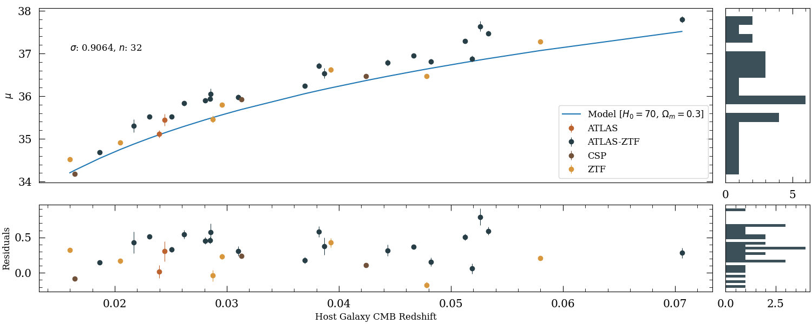
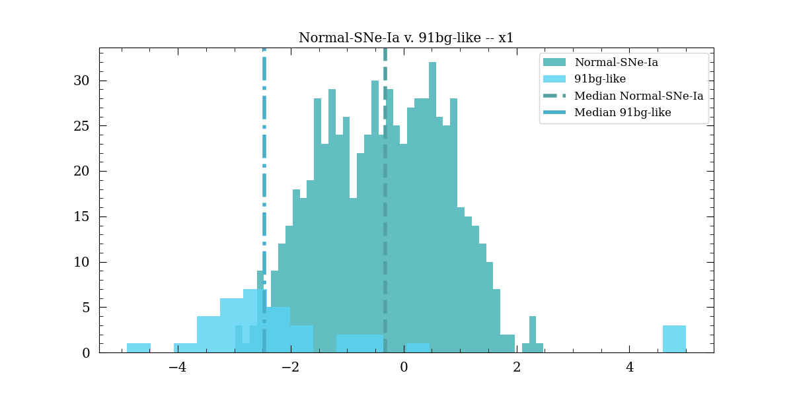
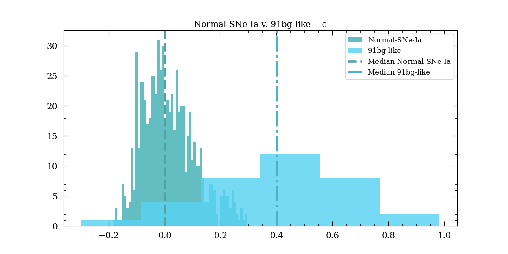

# Mass Step of Type-1a Supernova 1991bg
This repository works to analyze and calculate the mass step function of Supernovae Type Ia using forced photometry 
data from the ATLAS and ZTF surveys. This project is a segment of the collaboration 
'Hilo Cosmology And Transients (CATs)', an initiative operative from the University of Hawaii.  

__NOTE: This repository is currently under construction__

--------------------------
## Recent Plots
### Hubble Residual v. Redshift
This plot depicts the relationship between the redshift of the SN and the corresponding Hubble Residual.

--------------------------
### Hubble Residual v. Host Mass
This plot depicts the relationship between the mass of the host galaxy for the SN and the corresponding Hubble Residual. 

For perspective, below is the same plot for normal SNe Ia.

--------------------------
### Parameter Histograms
Below is the two main SNooPy parameters that determine the shape of the SN fit. 'DR3' is a collection of  normal 
SNe Ia processed with SNooPy. 

Salt2 parameters compared to Pantheon+ Survey of Normal SNe Ia

--------------------------
## Developers
* Developer: [Mekhi Woods](https://tinyurl.com/astrokhi) (mekhidw@hawaii.edu)
* Advisor: [David Jones](https://github.com/djones1040) (dojones@hawaii.edu)

--------------------------
## Publications
Please cite the following if this repo is utilized for a scientific project:
* Kenworthy et al. 2021. [SALT3: An Improved Type Ia Supernova Model for Measuring Cosmic Distances](https://ui.adsabs.harvard.edu/abs/2021ApJ...923..265K/abstract)
* Krisciunas et al. 2017. [The Carnegie Supernova Project. I. Third Photometry Data Release of Low-redshift Type Ia 
Supernovae and Other White Dwarf Explosions](https://ui.adsabs.harvard.edu/abs/2017AJ....154..211K/abstract)
* Burns et al. 2014. [The Carnegie Supernova Project: Intrinsic Colors of Type Ia Supernovae](https://ui.adsabs.harvard.edu/abs/2014ApJ...789...32B/abstract)
* Burns et al. 2011. [The Carnegie Supernova Project: Light-curve Fitting with SNooPy](https://ui.adsabs.harvard.edu/abs/2011AJ....141...19B/abstract)

--------------------------
## Dependencies
* python ( >= 3.11.9 )
* snpy (MacOS/Linux)
* astro_ghost
* astroquery
* astropy
* sncosmo
* iminuit
* ( glob /shutil / time / numpy / matplotlib )
